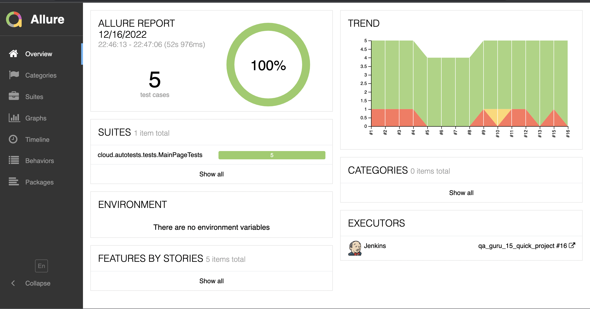
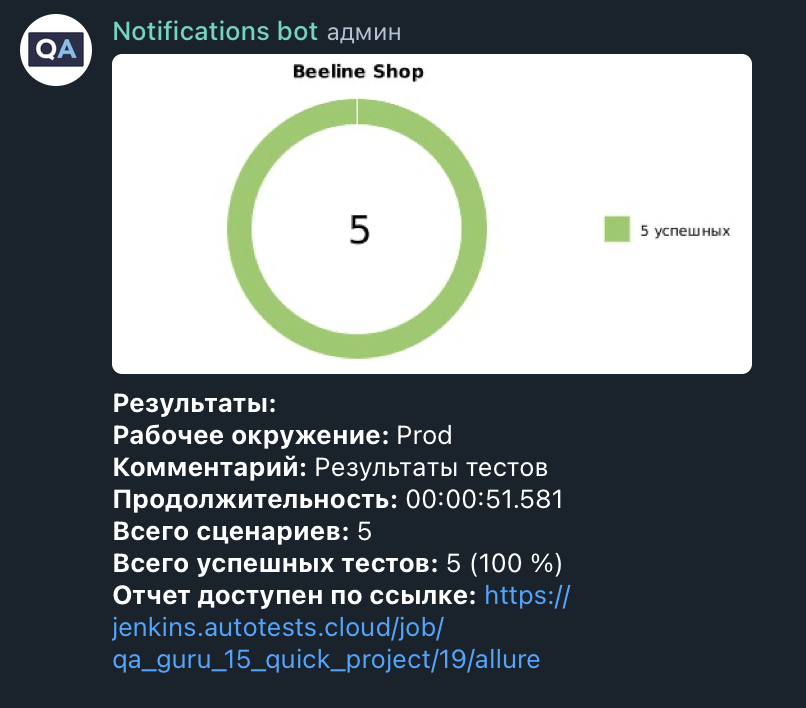

# Проект по автоматизации тестирования для Beeline Shop
<a target="_blank" href="https://shop.beeline.kz/ru/almaty">Вэб сайт Beeline shop </a>

## :pushpin: Содержание:

- [Технологии и инструменты](#earth_africa-технологии-и-инструменты)
- [Реализованные проверки](#earth_africa-Реализованные-проверки)
- [Сборка в Jenkins](#earth_africa-Jenkins-job)
- [Запуск из терминала](#earth_africa-Запуск-тестов-из-терминала)
- [Allure отчет](#earth_africa-Allure-отчет)
- [Интеграция с Allure TestOps](#earth_africa-Интеграция-с-Allure-TestOps)
- [Интеграция с Jira](#earth_africa-Интеграция-с-Jira)
- [Отчет в Telegram](#earth_africa-Уведомление-в-Telegram-при-помощи-бота)
- [Видео примеры прохождения тестов](#earth_africa-Примеры-видео-о-прохождении-тестов)

## :rocket: Технологии и инструменты

<p align="center">
<code></code>
<code></code>
<code></code>
<code></code>
<code></code>
<code></code>
<code></code>
<code></code>
<code></code>
<code></code>
<code></code>
<code></code>
<code></code>
</p>

## :scroll: Реализованные проверки

- ✓ Проверка поиска на главной странице.
- ✓ Проверка фильтра на странице Смартфоны.
- ✓ Проверка сортировки на странице Смартфоны".
- ✓ Проверка карточки товара на странице роутеры.
- ✓ Проверка страницу Оплата и Доставка.


## </a> Jenkins job
<a target="_blank" href="https://jenkins.autotests.cloud/job/qa_guru_15_quick_project/">Сборка в Jenkins</a>
<p align="center">
<a href="https://jenkins.autotests.cloud/job/qa_guru_15_quick_project/"></a>
</p>

### Параметры сборки в Jenkins:

- browser (браузер, по умолчанию chrome)
- browserVersion (версия браузера, по умолчанию 100.0)
- browserSize (размер окна браузера, по умолчанию 1920x1080)
- browserMobileView (название мобильного устройства, для примера iPhone X)
- remoteDriverUrl (логин, пароль и адрес удаленного сервера selenoid или grid)
- threads (количество потоков)

## :computer: Запуск тестов из терминала

Локальный запуск:
```bash
gradle clean test
```

Удаленный запуск:
```bash
clean
test
-Dbrowser=${BROWSER}
-DbrowserVersion=${BROWSER_VERSION}
-DbrowserSize=${BROWSER_SIZE}
-DbrowserMobileView="${BROWSER_MOBILE}"
-DremoteDriverUrl=https://${LOGIN}:${PASSWORD}@${REMOTE_DRIVER_URL}/wd/hub/
-Dthreads=${THREADS}
```

## </a> Отчет в <a target="_blank" href="https://jenkins.autotests.cloud/job/berezkindv_performance_lab_complete_project/22/allure/">Allure report</a>

### Основное окно

*Главная страница Allure-отчета содержит следующие информационные блоки:*

> - [x] <code><strong>*ALLURE REPORT*</strong></code> - отображает дату и время прохождения теста, общее количество прогнанных кейсов, а также диаграмму с указанием процента и количества успешных, упавших и сломавшихся в процессе выполнения тестов
>- [x] <code><strong>*TREND*</strong></code> - отображает тренд прохождения тестов от сборки к сборке
>- [x] <code><strong>*SUITES*</strong></code> - отображает распределение результатов тестов по тестовым наборам
>- [x] <code><strong>*ENVIRONMENT*</strong></code> - отображает тестовое окружение, на котором запускались тесты (в данном случае информация не задана)
>- [x] <code><strong>*CATEGORIES*</strong></code> - отображает распределение неуспешно прошедших тестов по видам дефектов
>- [x] <code><strong>*FEATURES BY STORIES*</strong></code> - отображает распределение тестов по функционалу, который они проверяют
>- [x] <code><strong>*EXECUTORS*</strong></code> - отображает исполнителя текущей сборки (ссылка на сборку в Jenkins)

<p align="center">
  
</p>

## </a>Интеграция с <a target="_blank" href="https://allure.autotests.cloud/launch/10223">Allure TestOps</a>

### Дашборд

<p align="center">

</p>

### Тест-кейсы

<p align="center">

</p>

## </a>Интеграция с трекером задач <a target="_blank" href="https://jira.autotests.cloud/browse/AUTO-628">Jira</a>

<p align="center">

</p>

## </a> Уведомление в Telegram при помощи бота

<p align="center">

</p>


### </a> Примеры видео о прохождении тестов

<p align="center">
  
</p>